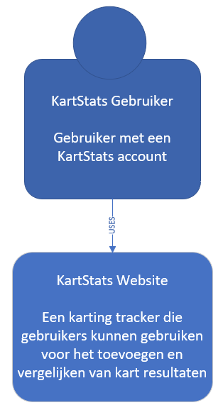
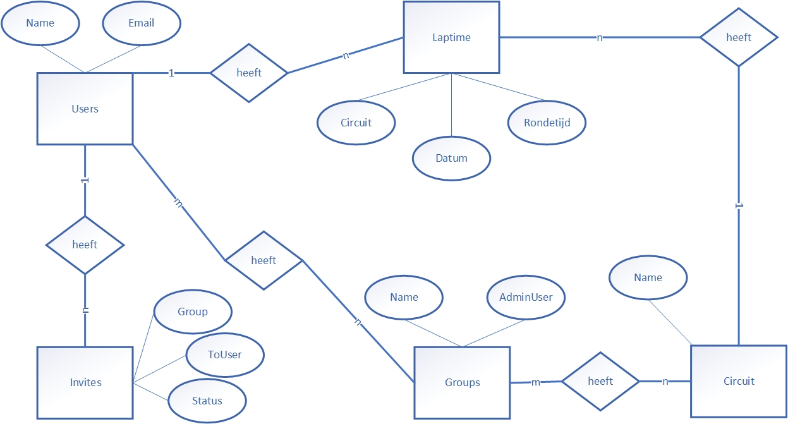

# Welkom bij KartStats!

KartStats is een webapplicatie waarin je jou kart resultaten kunt bijhouden en kunt vergelijken met de resultaten van anderen.

## Inleiding
KartStats is een karting resultaten tracker waarin je je resultaten kunt opslaan en jezelf kunt vergelijken met andere gebruikers. 
Doormiddel van groepen die gebruikers zelf aan kunnen maken is het mogelijk de resultaten van iedereen in de groep te categorieseren per circuit. 
Om wat meer inzicht te creëren over hoe deze webapplicatie ongeveer gaat werken is deze schets gemaakt waarin de requirements verwerkt zijn. 

## Requirements

Requirements voor de gebruiker:

FR-01: De gebruiker moet kunnen inloggen.
B-01.1: Het inlogproces moet beveiligd zijn met een gebruikersnaam en wachtwoord.

FR-02: De gebruiker moet een account kunnen aanmaken.
B-02.1: Het registratieproces moet persoonlijke gegevens bevatten, zoals naam, e-mailadres en wachtwoord.
B-02.2: Het wachtwoord moet beveiligd opgeslagen worden.

FR-03: De gebruiker moet zijn resultaten (snelste ronde) kunnen invoeren.
B-03.1: Er moet een functionaliteit zijn om resultaten in te voeren(snelste ronde).
B-03.2: De ingevoerde resultaten moeten gekoppeld zijn aan de specifieke gebruiker.

FR-04: De gebruiker moet de resultaten van gereden heats (snelste rondes) kunnen inzien.
B-04.1: Er moet een overzicht zijn van de resultaten(snelste rondes) van alle gereden heats.

FR-05: De gebruiker moet de resultaten kunnen zien in een grafiek.
B-05.1: Er moet een grafische weergave zijn van de resultaten, bijvoorbeeld een grafiek of diagram.

FR-06: De gebruiker moet zijn resultaten per circuit kunnen inzien.
B-06.1: Er moet een mogelijkheid zijn om resultaten per circuit te filteren en te bekijken.

FR-07: De gebruiker moet de snelste tijd per circuit kunnen zien.
B-07.1: Het systeem moet de snelste tijd per circuit berekenen en weergeven.

FR-08: De gebruiker moet een groep kunnen aanmaken en gebruikers kunnen uitnodigen/verwijderen uit de groep.
B-08.1: Er moet een functionaliteit zijn om een groep aan te maken.
B-08.2: De gebruiker moet andere gebruikers kunnen uitnodigen om lid te worden van de groep.
B-08.3: De gebruiker moet leden kunnen verwijderen uit de groep.

Requirements voor de beheerder:

FR-09: De beheerder moet circuits kunnen toevoegen.
B-09.1: Er moet een functionaliteit zijn om nieuwe circuits toe te voegen aan het systeem.

## Use Cases

| Naam | Samenvatting | Actoren | Aannamen | Scenario | Uitzonderingen | Resultaat |
| --- | --- | --- | --- | --- | --- | --- |
| UC01: Inloggen | De Karter kan inloggen op het systeem. | Karter | Geen | 1. De Karter opent de inlogpagina. 2. De Karter vult zijn gebruikersnaam en wachtwoord in. 3. Het systeem controleert de ingevoerde gegevens. 4. De Karter krijgt toegang tot het systeem. | Ongeldige inloggegevens. | De Karter is succesvol ingelogd. |
| UC02: Account aanmaken | De Karter kan een nieuw account aanmaken. | Karter | Geen | 1. De Karter opent het registratieformulier. 2. De Karter vult de vereiste persoonlijke gegevens in, zoals naam, e-mailadres en wachtwoord. 3. Het systeem slaat het account op met de ingevoerde gegevens. | Ongeldige of ontbrekende gegevens. | Het account is succesvol aangemaakt. |
| UC03: Resultaten invoeren | De Karter kan zijn resultaten (snelste ronde) invoeren. | Karter | De Karter is ingelogd. | 1. De Karter navigeert naar de pagina voor het invoeren van resultaten. 2. De Karter voert de snelste ronde in. 3. Het systeem koppelt de ingevoerde resultaten aan de Karter. | Geen | De resultaten zijn succesvol ingevoerd. |
| UC04: Resultaten inzien | De Karter kan de resultaten van gereden heats (snelste rondes) inzien. | Karter | De Karter is ingelogd. | 1. De Karter geeft aan dat hij de resultaten wil inzien. 2. Het systeem toont een overzichtspagina met alle gereden heats. 3. De Karter kan de resultaten, inclusief de snelste rondes, bekijken. | Geen | De Karter ziet de resultaten van alle gereden heats, inclusief de snelste rondes. |
| UC05: Resultaten (grafiek) inzien | De Karter bekijkt de resultaten in een grafische weergave. | Karter | De Karter is ingelogd. | 1. De Karter geeft aan dat hij de resultaten in een grafische weergave wil zien. 2. Het systeem toont een grafiek of diagram met de resultaten. | Geen | De Karter ziet de resultaten in een grafische weergave. |
| UC06: Resultaten per circuit inzien | De Karter bekijkt de resultaten per circuit. | Karter | De Karter is ingelogd. | 1. De Karter geeft aan dat hij de resultaten per circuit wil inzien. 2. Het systeem biedt een functionaliteit om resultaten per circuit te filteren. 3. De Karter selecteert een specifiek circuit. 4. Het systeem toont de resultaten van dat circuit. | Geen | De Karter ziet de resultaten van een specifiek circuit. |
| UC07: Snelste tijd per circuit zien | De Karter ziet de snelste tijd per circuit. | Karter | De Karter is ingelogd. | 1. De Karter geeft aan dat hij de snelste tijd per circuit wil zien. 2. Het systeem berekent de snelste tijd voor elk circuit. 3. Het systeem toont de snelste tijd per circuit. | Geen | De Karter ziet de snelste tijd per circuit. |
| UC08: Groep beheren | De Karter kan een groep aanmaken en leden uitnodigen/verwijderen. | Karter | De Karter is ingelogd. | 1. De Karter maakt een nieuwe groep aan. 2. De Karter nodigt andere Karters uit om lid te worden van de groep. 3. De Karter kan leden verwijderen uit de groep. | Geen | De Karter heeft succesvol een groep aangemaakt en leden uitgenodigd en/of verwijderd uit de groep. |
| UC09: Circuit toevoegen | De Beheerder voegt een nieuw circuit toe aan het systeem. | Beheerder | De beheerder is ingelogd | 1. De Beheerder geeft aan dat hij een nieuw circuit wil toevoegen. 2. Het systeem biedt een functionaliteit om een nieuw circuit toe te voegen. 3. De Beheerder vult de benodigde gegevens van het nieuwe circuit in en bevestigt. 4. Het systeem voegt het nieuwe circuit toe aan de lijst van beschikbare circuits. | Geen | Het nieuwe circuit is succesvol toegevoegd aan het systeem. |

## Contextdiagram en Conceptueel model

Om een idee te geven hoe de applicatie eruit komt te zien, heb ik een context diagram gemaakt. Ook heb ik een Conceptueel Model gemaakt die de structuur van de applicatie weergeeft.  Beide staan hieronder: 

Context Diagram             |  Conceptueel Model
:-------------------------:|:-------------------------:
  |  
